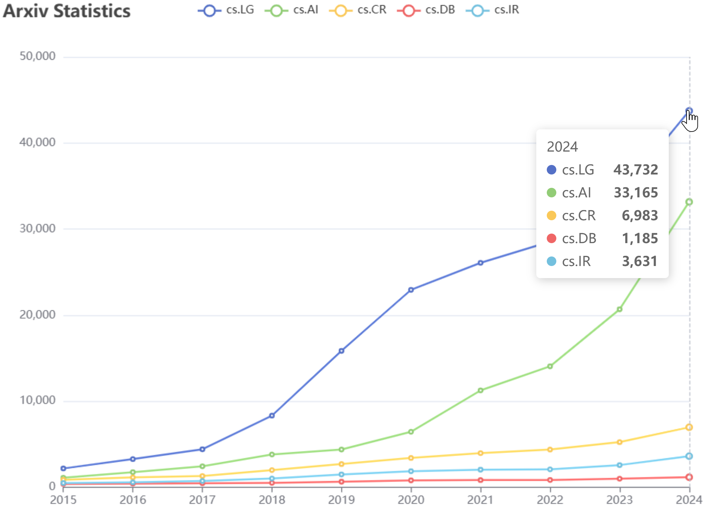
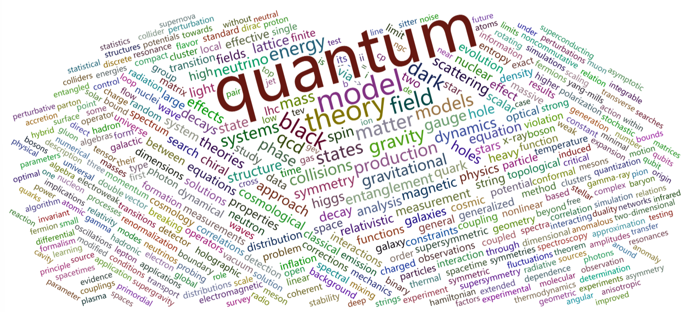

# Arxivict: Arxiv-(D)-ict, A Dictionary for All Arxiv Papers

Generate line chart and word cloud chart for selected categories and periods.

# Screenshot

## Line Chart

## Word Cloud

# Arxiv Dataset

Arxiv Dataset (about 4.43 GB) can be downloaded from Kaggle.com. (https://www.kaggle.com/datasets/Cornell-University/arxiv/data)

# License 

MIT
